# MboloeEats — Food Delivery Frontend

React Native / Expo mobile app for the MboloeEats food delivery platform.  
Customers can browse restaurants, build a cart, place orders, and receive live order-status updates in real time.

---

## Architecture

```mermaid
flowchart TD
    subgraph BOOT["App Bootstrap  ·  App.js"]
        A1[SafeAreaProvider]
        A2[AuthProvider]
        A3[AppContent]
        A4[CartProvider]
        A5["AuthenticatedApp\n─ socket listener\n─ order notification modal\n─ CartBottomSheet"]
        A1 --> A2 --> A3
        A3 -->|no user| AUTHSCR
        A3 -->|authenticated| A4 --> A5
    end

    AUTHSCR["AuthScreen\nPhone number → OTP → sign in"]

    subgraph NAV["Navigation"]
        N1[StackNavigator]
        N2[TabNavigator]
        N3[HomeScreen]
        N4[SearchScreen]
        N5[OrdersScreen]
        N6[ProfileScreen]
        N7[CheckoutScreen]
        N8[RestaurantDetailsScreen]
        A5 --> N1 --> N2
        N2 --> N3 & N4 & N5 & N6
        N1 --> N7 & N8
    end

    subgraph CTX["Global State  ·  React Context"]
        C1["AuthContext\nuser · firebaseUid · authLoading\nsendPhoneCode · verifyPhoneCode\nsignOutUser · getAuthToken"]
        C2["CartContext\ncartId · cartItems · cartCount · cartTotal\naddToCart · increaseQty · decreaseQty\nclearCart · openCartSheet"]
    end

    subgraph APIS["REST API Layer"]
        R1["restaurantApi\nGET /restaurants\nGET /restaurants/:id/menu"]
        R2["cartApi\nGET · POST · PUT · DELETE /carts"]
        R3["orderApi\nPOST /orders\nGET /orders/user/:uid"]
        R4["userApi  ·  likesApi\nfakePaymentApi"]
    end

    subgraph RT["Real-time  ·  Socket.io"]
        SK["utils/socket.js  —  singleton\nconnectSocket(token)\ndisconnectSocket()\ngetSocket()"]
    end

    subgraph UTILS["Utilities"]
        U1["cartFeedback.js\nplayCartTickSound()\nplayOrderStatusSound()"]
        U2["locationService.js\ngetCurrentLocation()\ngetLocationAddress()"]
        U3["colors.js  ·  formatXaf.js\nimageSource.js  ·  firebase.js"]
    end

    subgraph BACKEND["Backend  ·  192.168.0.152:5000"]
        B1["REST API  /api\nExpress routes"]
        B2["Socket.io Server\nauth middleware verifies JWT\nsocket.join customer:uid\nemit order_status_updated"]
        DB[(Neon PostgreSQL)]
        B1 <-->|queries| DB
        B2 <-->|queries| DB
    end

    subgraph EXT["External Services"]
        FB["Firebase Auth\nPhone OTP · SMS verification\ngetIdToken  →  JWT"]
    end

    %% ── Context consumption ──────────────────────────────
    AUTHSCR & N3 & N4 & N5 & N6 & N7 & N8 -->|useAuth| C1
    N3 & N4 & N5 & N6 & N7 & N8 & A5 -->|useCart| C2

    %% ── Auth ↔ Firebase ─────────────────────────────────
    C1 <-->|"signInWithPhoneNumber\nonAuthStateChanged · signOut"| FB

    %% ── Auth → Socket lifecycle ─────────────────────────
    C1 -->|"onAuthStateChanged\n→ connectSocket(token)"| SK
    C1 -->|"signOutUser\n→ disconnectSocket()"| SK

    %% ── Socket ↔ Backend ────────────────────────────────
    SK <-->|"WebSocket  auth:{token}"| B2

    %% ── App-level socket listener ───────────────────────
    A5 -->|getSocket| SK
    A5 -->|"order_status_updated\n→ slide-up modal"| U1

    %% ── OrdersScreen socket listener ────────────────────
    N5 -->|getSocket| SK
    N5 -.->|"order_status_updated\n→ patch order in list"| N5

    %% ── Screen → API calls ──────────────────────────────
    N3 & N4 -->|fetchRestaurants| R1
    N8 -->|fetchRestaurantMenu| R1
    N8 & N3 -->|likesApi| R4
    N7 -->|createOrder| R3
    N5 -->|fetchCustomerOrders| R3
    N7 -->|fakePaymentApi| R4
    C2 -->|"fetchActiveCart · addItemToCart\nupdateQty · clearCart"| R2
    C1 -->|"verifyPhoneCode\n→ syncUserWithNeon"| R4

    %% ── APIs → Backend ──────────────────────────────────
    R1 & R2 & R3 & R4 -->|"HTTP  Bearer token"| B1

    %% ── Feedback ────────────────────────────────────────
    C2 -->|"addToCart → playCartTickSound"| U1
    N3 & N5 & N6 & N7 & N8 -->|location| U2

    classDef screen fill:#e0f2fe,stroke:#0284c7,color:#0c2340
    classDef context fill:#fef3c7,stroke:#d97706,color:#0c2340
    classDef api fill:#f0fdf4,stroke:#0d9668,color:#0c2340
    classDef util fill:#f8fafc,stroke:#94a3b8,color:#0c2340
    classDef backend fill:#fdf4ff,stroke:#7c3aed,color:#0c2340
    classDef ext fill:#fff1f2,stroke:#dc2626,color:#0c2340

    class N3,N4,N5,N6,N7,N8,AUTHSCR screen
    class C1,C2 context
    class R1,R2,R3,R4 api
    class SK,U1,U2,U3 util
    class B1,B2,DB backend
    class FB ext
```



---

## Tech Stack

| Layer      | Technology                                    |
| ---------- | --------------------------------------------- |
| Framework  | React Native + Expo ~54                       |
| Language   | JavaScript (ES modules)                       |
| Navigation | React Navigation — Native Stack + Bottom Tabs |
| Auth       | Firebase Auth — Phone OTP                     |
| Real-time  | Socket.io client                              |
| Database   | Neon PostgreSQL (via backend)                 |
| Fonts      | Nunito · Inter (Expo Google Fonts)            |
| Audio      | expo-audio                                    |
| Haptics    | expo-haptics                                  |
| Location   | expo-location                                 |

---

## Project Structure

```
App.js                          # Root — providers, authenticated shell, notification modal
├── context/
│   ├── AuthContext.js          # Firebase auth state + socket lifecycle
│   └── CartContext.js          # Cart state + cart API calls
├── navigation/
│   ├── StackNavigator.js       # Root stack
│   └── TabNavigator.js         # Bottom tab bar
├── screens/
│   ├── AuthScreen.js           # Phone OTP login
│   ├── HomeScreen.js           # Restaurant feed
│   ├── SearchScreen.js         # Search + cuisine filter
│   ├── RestaurantDetailsScreen.js  # Menu + add to cart
│   ├── CheckoutScreen.js       # Payment + order placement
│   ├── OrdersScreen.js         # Order history + live status updates
│   └── ProfileScreen.js        # Account settings
├── apis/
│   ├── restaurantApi.js
│   ├── cartApi.js
│   ├── orderApi.js
│   ├── userApi.js
│   ├── likesApi.js
│   └── fakePaymentApi.js
├── components/
│   ├── RestaurantCard.js
│   ├── CartBottomSheet.js
│   ├── CartHeaderButton.js
│   ├── LikeButton.js
│   └── AnimatedTabBarButton.js
└── utils/
    ├── socket.js               # Socket.io singleton
    ├── cartFeedback.js         # Audio + haptics
    ├── firebase.js             # Firebase config
    ├── locationService.js
    ├── colors.js
    └── formatXaf.js
```

---

## Real-time Order Updates

When a restaurant accepts or cancels an order:

1. Backend emits `order_status_updated` to the customer's socket room (`customer:<firebaseUid>`)
2. `AuthenticatedApp` (root level) receives the event on any screen and shows a slide-up notification modal with sound and haptic feedback
3. `OrdersScreen` independently patches the order's status in the list in-place — no reload needed

```
Restaurant dashboard action
  → backend: io.to("customer:<uid>").emit("order_status_updated", { orderId, status, updatedAt })
  → AuthenticatedApp: modal slides up  +  hint-notification.wav  +  haptic
  → OrdersScreen: order card status updates live
```
