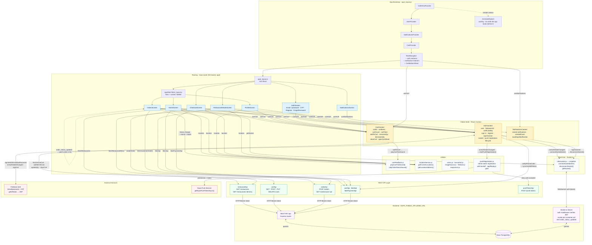

# MboloeEats — Food Delivery Frontend

React Native / Expo mobile app for the MboloeEats food delivery platform.  
Customers can browse restaurants, build a cart, place orders, and receive live order-status updates in real time.

---

## Architecture


```mermaid
flowchart TD
    subgraph BOOT["App Bootstrap  ·  app/_layout.js"]
        A1[SafeAreaProvider]
        A2[AuthProvider]
        A2b[NotificationsProvider]
        A3[CartProvider]
        A4["RootNavigator\n─ auth redirects\n─ notification listeners\n─ CartBottomSheet"]
        A5["AnimatedSplash\noverlay ~3s while the app boots behind it"]
        A1 --> A2 --> A2b --> A3 --> A4
        A1 -.->|renders above| A5
    end

    AUTHSCR["AuthScreen\nEmail / password · OTP · Register · ForgotPassword"]

    subgraph NAV["Routing  ·  expo-router (file-based, app/)"]
        N1["app/_layout.js\nroot Stack"]
        N2["app/MainTabs/_layout.js\nTabs + custom TabBar"]
        N3[HomeScreen]
        N5[OrdersScreen]
        N6[ProfileScreen]
        N7[CheckoutScreen]
        N8[RestaurantDetailsScreen]
        N9[NotificationsScreen]
        A4 --> N1 --> N2
        N2 --> N3 & N5 & N6
        N1 --> N7 & N8 & N9 & AUTHSCR
    end

    subgraph CTX["Global State  ·  React Context"]
        C1["AuthContext\nuser · firebaseUid · authLoading\nsign in · register · signOutUser\nsocket + push registration lifecycle"]
        C2["CartContext\ncartId · cartItems · cartCount · cartTotal\naddToCart · increaseQty · decreaseQty\nclearCart · openCartSheet"]
        C3["NotificationsContext\nstored notifications · unreadCount\nsaveExpoNotification"]
    end

    subgraph APIS["REST API Layer"]
        R1["restaurantApi\nGET /restaurants\nGET /restaurants/:id/menu"]
        R2["cartApi\nGET · POST · PUT · DELETE /carts"]
        R3["orderApi\nPOST /orders\nGET /orders/user/:uid"]
        R4["userApi  ·  likesApi\nfakePaymentApi"]
        R5["pushTokenApi\nPOST /push-tokens"]
    end

    subgraph RT["Real-time  ·  Socket.io"]
        SK["utils/socket.js  —  singleton\nconnectSocket(token)\ndisconnectSocket()\ngetSocket()"]
    end

    subgraph UTILS["Utilities"]
        U1["cartFeedback.js\nplayCartTickSound()\nplayOrderStatusSound()"]
        U2["locationService.js\ngetCurrentLocation()\ngetLocationAddress()"]
        U3["colors.js  ·  formatXaf.js\nimageSource.js  ·  firebase.js\nresponsive.js"]
        U4["pushRegistration.js\nretries token registration\nwith backoff · appReady.js gate"]
    end

    subgraph BACKEND["Backend  ·  EXPO_PUBLIC_API_BASE_URL"]
        B1["REST API  /api\nExpress routes"]
        B2["Socket.io Server\nauth middleware verifies JWT\nsocket.join customer:uid\nemit order_status_updated"]
        DB[(Neon PostgreSQL)]
        B1 <-->|queries| DB
        B2 <-->|queries| DB
    end

    subgraph EXT["External Services"]
        FB["Firebase Auth\nEmail/password · OTP\ngetIdToken  →  JWT"]
        EXPO["Expo Push Service\ngetExpoPushTokenAsync()"]
    end

    %% ── Context consumption ──────────────────────────────
    AUTHSCR & N3 & N5 & N6 & N7 & N8 -->|useAuth| C1
    N3 & N5 & N6 & N7 & N8 & A4 -->|useCart| C2
    N9 & A4 -->|useNotifications| C3

    %% ── Auth ↔ Firebase ─────────────────────────────────
    C1 <-->|"signInWithEmailAndPassword\nonAuthStateChanged · signOut"| FB

    %% ── Push registration ───────────────────────────────
    C1 -->|"onAuthStateChanged\n→ startPushRegistration()"| U4
    U4 -->|"permission + token"| EXPO
    U4 -->|"retry until accepted"| R5

    %% ── Auth → Socket lifecycle ─────────────────────────
    C1 -->|"onAuthStateChanged\n→ connectSocket(token)"| SK
    C1 -->|"signOutUser\n→ disconnectSocket()"| SK

    %% ── Socket ↔ Backend ────────────────────────────────
    SK <-->|"WebSocket  auth:{token}"| B2

    %% ── OrdersScreen socket listener ────────────────────
    N5 -->|getSocket| SK
    N5 -.->|"order_status_updated\n→ patch order in list"| N5
    N5 -->|"status change\n→ sound + haptic"| U1

    %% ── Screen → API calls ──────────────────────────────
    N3 -->|fetchRestaurants| R1
    N8 -->|fetchRestaurantMenu| R1
    N8 & N3 -->|likesApi| R4
    N7 -->|createOrder| R3
    N5 -->|fetchCustomerOrders| R3
    N7 -->|fakePaymentApi| R4
    C2 -->|"fetchActiveCart · addItemToCart\nupdateQty · clearCart"| R2
    C1 -->|"verifyPhoneCode\n→ syncUserWithNeon"| R4

    %% ── APIs → Backend ──────────────────────────────────
    R1 & R2 & R3 & R4 -->|"HTTP  Bearer token"| B1

    %% ── Feedback ────────────────────────────────────────
    C2 -->|"addToCart → playCartTickSound"| U1
    N3 & N5 & N6 & N7 & N8 -->|location| U2

    classDef screen fill:#e0f2fe,stroke:#0284c7,color:#0c2340
    classDef context fill:#fef3c7,stroke:#d97706,color:#0c2340
    classDef api fill:#f0fdf4,stroke:#0d9668,color:#0c2340
    classDef util fill:#f8fafc,stroke:#94a3b8,color:#0c2340
    classDef backend fill:#fdf4ff,stroke:#7c3aed,color:#0c2340
    classDef ext fill:#fff1f2,stroke:#dc2626,color:#0c2340

    class N3,N5,N6,N7,N8,N9,AUTHSCR screen
    class C1,C2,C3 context
    class R1,R2,R3,R4,R5 api
    class SK,U1,U2,U3,U4 util
    class B1,B2,DB backend
    class FB,EXPO ext
```

---

## Tech Stack

| Layer      | Technology                                        |
| ---------- | ------------------------------------------------- |
| Framework  | React Native 0.81 + Expo ~54 (New Architecture)   |
| Language   | JavaScript (ES modules)                           |
| Routing    | expo-router — file-based, `app/`                  |
| Auth       | Firebase Auth — email/password + OTP              |
| Real-time  | Socket.io client                                  |
| Push       | expo-notifications + Expo push service            |
| Database   | Neon PostgreSQL (via backend)                     |
| Fonts      | Plus Jakarta Sans (Expo Google Fonts)             |
| Animation  | react-native-reanimated 4                         |
| Audio      | expo-audio                                        |
| Haptics    | expo-haptics                                      |
| Location   | expo-location                                     |

> Routing note: `package.json` sets `"main": "expo-router/entry"`, so the app boots
> from [`app/_layout.js`](app/_layout.js). React Navigation is still present as a
> transitive dependency of expo-router — the tab and stack navigators come from it —
> but there are no hand-written navigator files.

---

## Project Structure

Route files under `app/` are thin re-exports of the matching component in
`screens/` — e.g. `app/Auth.js` is `export { default } from "../screens/AuthScreen"`.

```
app/                            # expo-router routes (the entry point)
├── _layout.js                  # Root — providers, Stack, splash, notification listeners
├── index.js                    # Redirects to /MainTabs/HomeTab or /Auth
├── Auth.js  Register.js  ForgotPassword.js
├── RestaurantDetails.js  Checkout.js  Notifications.js
└── MainTabs/
    ├── _layout.js              # Tabs + custom TabBar
    └── HomeTab.js  OrdersTab.js  ProfileTab.js
context/
├── AuthContext.js              # Firebase auth + socket + push registration lifecycle
├── CartContext.js              # Cart state + cart API calls
└── NotificationsContext.js     # Stored notifications + unread count
screens/
├── AuthScreen.js  RegisterScreen.js  ForgotPasswordScreen.js
├── HomeScreen.js               # Restaurant feed + food filter + search
├── RestaurantDetailsScreen.js  # Menu + add to cart
├── CheckoutScreen.js           # MoMo / Orange Money / cash + order placement
├── OrdersScreen.js             # Order history + live status updates
├── ProfileScreen.js            # Account settings
└── NotificationsScreen.js      # Push + order notification history
apis/
├── restaurantApi.js  cartApi.js  orderApi.js
└── userApi.js  likesApi.js  fakePaymentApi.js  pushTokenApi.js
components/
├── AnimatedSplash.js           # ~3s branded splash overlay
├── TabBar.js  TabBarButton.js  # Custom animated tab bar
├── RestaurantCard.js  CartBottomSheet.js  CartHeaderButton.js
├── HomeFoodFilter.js  HomeSearchBar.js  HomeGreetingBanner.js
├── NotificationCard.js  NotificationHeaderButton.js
├── LikeButton.js  FloatingBasketButton.js  LoadingPlaceholder.js
└── styles.js  useRootCartHeader.js
utils/
├── socket.js                   # Socket.io singleton
├── pushNotifications.js        # Permission + Expo token
├── pushRegistration.js         # Retry-with-backoff token registration
├── appReady.js                 # Gate that holds OS prompts until the splash clears
├── responsive.js               # Header heights, safe-area offsets, breakpoints
├── cartFeedback.js             # Audio + haptics
├── firebase.js  locationService.js
└── colors.js  formatXaf.js  imageSource.js  formatRestaurantName.js
```

---

## Real-time Order Updates

When a restaurant accepts or cancels an order:

1. Backend emits `order_status_updated` to the customer's socket room (`customer:<firebaseUid>`)
2. `OrdersScreen` patches the order's status in the list in-place — no reload needed — and plays a sound plus haptic feedback
3. Independently, a push notification is delivered via Expo and stored by `NotificationsContext`, surfacing on `NotificationsScreen` and in the header badge

```
Restaurant dashboard action
  → backend: io.to("customer:<uid>").emit("order_status_updated", { orderId, status, updatedAt })
  → OrdersScreen: order card status updates live  +  hint-notification.wav  +  haptic
  → expo push  →  NotificationsContext  →  unread badge + Notifications screen
```

---

## Restaurant Images

The hero on `RestaurantCard` **takes each image's own proportions**. On load the
card reads the image's intrinsic size and sets the frame to match
(`handleHeroLoad` in
[`components/RestaurantCard.js`](components/RestaurantCard.js)), so every picture
**spans the full card width** and is **never cropped**, with no bands either.

Any fixed frame has to give up one of those two — it either crops to fill or
leaves white space on whichever axis does not match — which is why the frame
follows the image instead.

The trade-off is that **card heights vary**: a wide photo produces a short hero,
a tall one a deep hero. Keeping your images to a consistent shape is what keeps
the list looking even.

| | |
| ---------------- | --------------------------------------------------- |
| Shape            | pick one and stick to it — **4:3** is a good default |
| Target size      | **1200 × 900 px** (4:3)                              |
| Minimum          | 1000 px on the long edge                             |
| Do not exceed    | ~1440 px on the long edge                            |
| Accepted range   | 0.7 – 2.5 aspect; outside that the frame clamps      |
| Format           | JPEG, quality 75–80 (PNG only if transparency needed)|
| Weight           | ≤ 150 KB                                             |

**Why those numbers.** The card is capped at `CARD_MAX_WIDTH` (640dp) and sits
inside the list padding, so it renders around 1020px wide on a typical phone and
about 1440px at most on a tablet or high-density device. Anything larger is
bandwidth spent on pixels nobody sees — and the home screen downloads *every*
card image, so twenty restaurants at 150KB is already ~3MB per load on mobile
data.

On a 315dp-wide card: a 4:3 image gives a 236dp hero, 16:9 gives 177dp, a square
logo gives 315dp, and a 3:4 portrait gives 420dp. All span the full width and
show in full — they just make the cards different heights, so mixing shapes makes
the list look ragged.

Beyond the 0.7–2.5 range the frame clamps and the image is banded rather than
allowed to produce an absurdly tall or wide card.

### Logos

Logos are safe — a mark is never sliced in half, and a square logo spans the full
card width. It will simply make that card taller than one showing a wide photo.

If an even list matters more, place logos on a canvas matching your chosen
standard shape (4:3, say) with a brand-colour or white background before
uploading, so every card comes out the same height.

Prefer a photograph of the food or the premises wherever one exists.

### Composition

Nothing is cropped, so there is no unsafe edge for subject matter. Do keep text
clear of the top-right corner, where the "Currently Closed" badge sits.

Consistency of *shape* matters more than the shape you pick.

### Enforcing it

Upload discipline is not reliable on its own. A **server-side normalise on
upload** — resize onto a consistent canvas, strip oversized originals — keeps
card rendering predictable regardless of what a restaurant sends, and caps the
bandwidth cost.

> Current seed data hotlinks third-party URLs — Unsplash, WordPress blogs, a
> YouTube thumbnail. At least one carries a `w=200` parameter, so it is a 200px
> image being upscaled roughly 5× on the card and will look badly blurred. These
> should be re-hosted and normalised.
