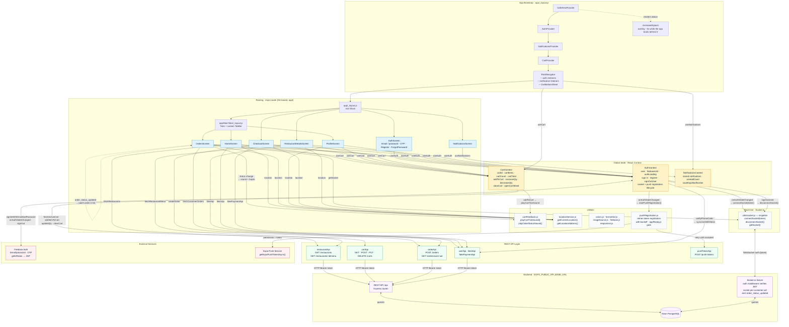

# MboloeEats — Food Delivery Frontend

React Native / Expo mobile app for the MboloeEats food delivery platform.  
Customers can browse restaurants, build a cart, place orders, and receive live order-status updates in real time.

---

## Architecture


```mermaid
flowchart TD
    subgraph BOOT["App Bootstrap  ·  app/_layout.js"]
        A1[SafeAreaProvider]
        A2[AuthProvider]
        A2b[NotificationsProvider]
        A3[CartProvider]
        A4["RootNavigator\n─ auth redirects\n─ notification listeners\n─ CartBottomSheet"]
        A5["AnimatedSplash\noverlay ~3s while the app boots behind it"]
        A1 --> A2 --> A2b --> A3 --> A4
        A1 -.->|renders above| A5
    end

    AUTHSCR["AuthScreen\nEmail / password · OTP · Register · ForgotPassword"]

    subgraph NAV["Routing  ·  expo-router (file-based, app/)"]
        N1["app/_layout.js\nroot Stack"]
        N2["app/MainTabs/_layout.js\nTabs + custom TabBar"]
        N3[HomeScreen]
        N5[OrdersScreen]
        N6[ProfileScreen]
        N7[CheckoutScreen]
        N8[RestaurantDetailsScreen]
        N9[NotificationsScreen]
        A4 --> N1 --> N2
        N2 --> N3 & N5 & N6
        N1 --> N7 & N8 & N9 & AUTHSCR
    end

    subgraph CTX["Global State  ·  React Context"]
        C1["AuthContext\nuser · firebaseUid · authLoading\nsign in · register · signOutUser\nsocket + push registration lifecycle"]
        C2["CartContext\ncartId · cartItems · cartCount · cartTotal\naddToCart · increaseQty · decreaseQty\nclearCart · openCartSheet"]
        C3["NotificationsContext\nstored notifications · unreadCount\nsaveExpoNotification"]
    end

    subgraph APIS["REST API Layer"]
        R1["restaurantApi\nGET /restaurants\nGET /restaurants/:id/menu"]
        R2["cartApi\nGET · POST · PUT · DELETE /carts"]
        R3["orderApi\nPOST /orders\nGET /orders/user/:uid"]
        R4["userApi  ·  likesApi\nfakePaymentApi"]
        R5["pushTokenApi\nPOST /push-tokens"]
    end

    subgraph RT["Real-time  ·  Socket.io"]
        SK["utils/socket.js  —  singleton\nconnectSocket(token)\ndisconnectSocket()\ngetSocket()"]
    end

    subgraph UTILS["Utilities"]
        U1["cartFeedback.js\nplayCartTickSound()\nplayOrderStatusSound()"]
        U2["locationService.js\ngetCurrentLocation()\ngetLocationAddress()"]
        U3["colors.js  ·  formatXaf.js\nimageSource.js  ·  firebase.js\nresponsive.js"]
        U4["pushRegistration.js\nretries token registration\nwith backoff · appReady.js gate"]
    end

    subgraph BACKEND["Backend  ·  EXPO_PUBLIC_API_BASE_URL"]
        B1["REST API  /api\nExpress routes"]
        B2["Socket.io Server\nauth middleware verifies JWT\nsocket.join customer:uid\nemit order_status_updated"]
        DB[(Neon PostgreSQL)]
        B1 <-->|queries| DB
        B2 <-->|queries| DB
    end

    subgraph EXT["External Services"]
        FB["Firebase Auth\nEmail/password · OTP\ngetIdToken  →  JWT"]
        EXPO["Expo Push Service\ngetExpoPushTokenAsync()"]
    end

    %% ── Context consumption ──────────────────────────────
    AUTHSCR & N3 & N5 & N6 & N7 & N8 -->|useAuth| C1
    N3 & N5 & N6 & N7 & N8 & A4 -->|useCart| C2
    N9 & A4 -->|useNotifications| C3

    %% ── Auth ↔ Firebase ─────────────────────────────────
    C1 <-->|"signInWithEmailAndPassword\nonAuthStateChanged · signOut"| FB

    %% ── Push registration ───────────────────────────────
    C1 -->|"onAuthStateChanged\n→ startPushRegistration()"| U4
    U4 -->|"permission + token"| EXPO
    U4 -->|"retry until accepted"| R5

    %% ── Auth → Socket lifecycle ─────────────────────────
    C1 -->|"onAuthStateChanged\n→ connectSocket(token)"| SK
    C1 -->|"signOutUser\n→ disconnectSocket()"| SK

    %% ── Socket ↔ Backend ────────────────────────────────
    SK <-->|"WebSocket  auth:{token}"| B2

    %% ── OrdersScreen socket listener ────────────────────
    N5 -->|getSocket| SK
    N5 -.->|"order_status_updated\n→ patch order in list"| N5
    N5 -->|"status change\n→ sound + haptic"| U1

    %% ── Screen → API calls ──────────────────────────────
    N3 -->|fetchRestaurants| R1
    N8 -->|fetchRestaurantMenu| R1
    N8 & N3 -->|likesApi| R4
    N7 -->|createOrder| R3
    N5 -->|fetchCustomerOrders| R3
    N7 -->|fakePaymentApi| R4
    C2 -->|"fetchActiveCart · addItemToCart\nupdateQty · clearCart"| R2
    C1 -->|"verifyPhoneCode\n→ syncUserWithNeon"| R4

    %% ── APIs → Backend ──────────────────────────────────
    R1 & R2 & R3 & R4 -->|"HTTP  Bearer token"| B1

    %% ── Feedback ────────────────────────────────────────
    C2 -->|"addToCart → playCartTickSound"| U1
    N3 & N5 & N6 & N7 & N8 -->|location| U2

    classDef screen fill:#e0f2fe,stroke:#0284c7,color:#0c2340
    classDef context fill:#fef3c7,stroke:#d97706,color:#0c2340
    classDef api fill:#f0fdf4,stroke:#0d9668,color:#0c2340
    classDef util fill:#f8fafc,stroke:#94a3b8,color:#0c2340
    classDef backend fill:#fdf4ff,stroke:#7c3aed,color:#0c2340
    classDef ext fill:#fff1f2,stroke:#dc2626,color:#0c2340

    class N3,N5,N6,N7,N8,N9,AUTHSCR screen
    class C1,C2,C3 context
    class R1,R2,R3,R4,R5 api
    class SK,U1,U2,U3,U4 util
    class B1,B2,DB backend
    class FB,EXPO ext
```

---

## Tech Stack

| Layer      | Technology                                        |
| ---------- | ------------------------------------------------- |
| Framework  | React Native 0.81 + Expo ~54 (New Architecture)   |
| Language   | JavaScript (ES modules)                           |
| Routing    | expo-router — file-based, `app/`                  |
| Auth       | Firebase Auth — email/password + OTP              |
| Real-time  | Socket.io client                                  |
| Push       | expo-notifications + Expo push service            |
| Database   | Neon PostgreSQL (via backend)                     |
| Fonts      | Plus Jakarta Sans (Expo Google Fonts)             |
| Animation  | react-native-reanimated 4                         |
| Audio      | expo-audio                                        |
| Haptics    | expo-haptics                                      |
| Location   | expo-location                                     |

> Routing note: `package.json` sets `"main": "expo-router/entry"`, so the app boots
> from [`app/_layout.js`](app/_layout.js). React Navigation is still present as a
> transitive dependency of expo-router — the tab and stack navigators come from it —
> but there are no hand-written navigator files.

---

## Project Structure

Route files under `app/` are thin re-exports of the matching component in
`screens/` — e.g. `app/Auth.js` is `export { default } from "../screens/AuthScreen"`.

```
app/                            # expo-router routes (the entry point)
├── _layout.js                  # Root — providers, Stack, splash, notification listeners
├── index.js                    # Redirects to /MainTabs/HomeTab or /Auth
├── Auth.js  Register.js  ForgotPassword.js
├── RestaurantDetails.js  Checkout.js  Notifications.js
└── MainTabs/
    ├── _layout.js              # Tabs + custom TabBar
    └── HomeTab.js  OrdersTab.js  ProfileTab.js
context/
├── AuthContext.js              # Firebase auth + socket + push registration lifecycle
├── CartContext.js              # Cart state + cart API calls
└── NotificationsContext.js     # Stored notifications + unread count
screens/
├── AuthScreen.js  RegisterScreen.js  ForgotPasswordScreen.js
├── HomeScreen.js               # Restaurant feed + food filter + search
├── RestaurantDetailsScreen.js  # Menu + add to cart
├── CheckoutScreen.js           # MoMo / Orange Money / cash + order placement
├── OrdersScreen.js             # Order history + live status updates
├── ProfileScreen.js            # Account settings
└── NotificationsScreen.js      # Push + order notification history
apis/
├── restaurantApi.js  cartApi.js  orderApi.js
└── userApi.js  likesApi.js  fakePaymentApi.js  pushTokenApi.js
components/
├── AnimatedSplash.js           # ~3s branded splash overlay
├── TabBar.js  TabBarButton.js  # Custom animated tab bar
├── RestaurantCard.js  CartBottomSheet.js  CartHeaderButton.js
├── HomeFoodFilter.js  HomeSearchBar.js  HomeGreetingBanner.js
├── NotificationCard.js  NotificationHeaderButton.js
├── LikeButton.js  FloatingBasketButton.js  LoadingPlaceholder.js
└── styles.js  useRootCartHeader.js
utils/
├── socket.js                   # Socket.io singleton
├── pushNotifications.js        # Permission + Expo token
├── pushRegistration.js         # Retry-with-backoff token registration
├── appReady.js                 # Gate that holds OS prompts until the splash clears
├── responsive.js               # Header heights, safe-area offsets, breakpoints
├── cartFeedback.js             # Audio + haptics
├── firebase.js  locationService.js
└── colors.js  formatXaf.js  imageSource.js  formatRestaurantName.js
```

---

## Real-time Order Updates

When a restaurant accepts or cancels an order:

1. Backend emits `order_status_updated` to the customer's socket room (`customer:<firebaseUid>`)
2. `OrdersScreen` patches the order's status in the list in-place — no reload needed — and plays a sound plus haptic feedback
3. Independently, a push notification is delivered via Expo and stored by `NotificationsContext`, surfacing on `NotificationsScreen` and in the header badge

```
Restaurant dashboard action
  → backend: io.to("customer:<uid>").emit("order_status_updated", { orderId, status, updatedAt })
  → OrdersScreen: order card status updates live  +  hint-notification.wav  +  haptic
  → expo push  →  NotificationsContext  →  unread badge + Notifications screen
```
